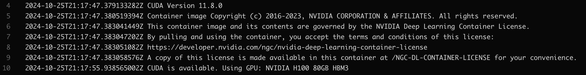

# Container Creation and Testing Exercise

## Updating the Dockerfile for CUDA and 🤗 on H100 
We need to ensure that the Dockerfile is using a CUDA version that supports the latest NVIDIA H100 GPUs, and install the necessary libraries, including 🤗 `transformers` and `accelerate` for optimal GPU support. 
The base image should also include the `cuDNN` library.

The dockerfile can be found [here](./Dockerfile).

CUDA device compatibility can be tricky, you can find the hardware based `Compute Capability` matrix [here](https://developer.nvidia.com/cuda-gpus). To check which CUDA Toolkit version is supported, have a look at [CUDA Wikipedia page](https://en.wikipedia.org/wiki/CUDA#GPUs_supported). For the H100 the CUDA Toolkit version should be 11.8 or higher.

## Local Build and Distribution
### Building the Docker Image
To build the Docker image locally, run the the following command:
```bash
build_local.sh
```
This script will build the Docker image using the Dockerfile provided.
This output will be based on the result of the test_script.py script, which will be run inside the Docker container.

### Distributing the Docker Image to a Registry
To distribute the Docker image to a registry, you first need to authenticate with the registry.
For example for the Google Container Registry (GCR), you can authenticate using the following command:
```bash
gcloud auth configure-docker
```
Then you can tag the image using the following command:
```bash
docker tag hf-transformers-cuda gcr.io/<your-project-id>/hf-transformers-cuda:latest
```
Finally, you can push the image to the registry using the following command:
```bash
docker push gcr.io/<your-project-id>/hf-transformers-cuda:latest
```

## CI-CD Build and Distribution
By utilizing a CI/CD pipeline, teams can automate the processes of building, testing, and deploying their Docker images. This can be effectively accomplished using tools like GitHub Actions, AWS CodePipeline, or GCP Cloud Build.

To ensure that automated builds are successful, it's essential to verify that the Docker image functions correctly and that all tests pass. One effective strategy is to tag the image with the build number or a dev tag. Then, this tagged image can be pulled to a runner equipped with an H100 GPU to execute the tests. If all tests are successful, the image can then be pushed to the registry with the `latest` tag.

You can find an example of a GitHub Actions workflow [here](./.github/workflows/build-and-test.yml). 
You will see that the last step `Tag and Push the latest Docker image` is skipped because the free tier of GitHub Actions does not support GPU's so the tests will fail.


## Testing the Docker Image on a H100
To test the Docker image on an H100 GPU, I rented one on [Runpod](https://www.runpod.io).
You can see the results in the image below.
